# 🧪 🧩 3D MolBuilder

[](https://react.dev/)
[](https://www.typescriptlang.org/)
[](https://vitejs.dev/)
[](https://threejs.org/)
[](https://tailwindcss.com/)
[-38ef7d?logo=playwright&logoColor=white)](qa_e2e_report.md)
[](docs/multi_device_guide.md)
[](docs/architecture.md)
[](LICENSE)

**3D MolBuilder** es una plataforma interactiva tridimensional y aplicación gamificada de modelado molecular, desarrollada específicamente para ferias científicas escolares y talleres de extensión de **Vinculación con el Medio (VcM)** de la **Universidad San Sebastián (USS)**.

Permite a estudiantes de educación media (3.° y 4.° Medio) interactuar en equipo visualizando estructuras moleculares 3D analíticas con rigor científico (CPK, Van der Waals, Malla 3D), consultar fichas didácticas de química cotidiana y replicar el ensamblado físico con kits de esferas y conectores moleculares en rondas contra reloj sincronizadas en red local (LAN) hacia una pantalla gigante de auditorio.

---

## 🏛️ Créditos y Autores

* **Autor Principal & Arquitecto de Software:** Moisés Amundarain Romero
* **Co-Autores Científicos:** 
  - **Gamaliel Cisternas Herrera** (Estudiante de Química y Farmacia USS)
  - **Diego Pavez Gallardo** (Estudiante de Química y Farmacia USS)
* **Profesora Guía & Líder Académica:** **Dra. Fabiola Acuña Sanhueza** (Docente de Química General USS)

---

## 📸 Demostración Visual del Software

### 🌟 1. Estación de Alumnos — Interfaz Principal & Fondo Procedural OLED
Vista de la estación de trabajo escolar en la Ronda 1 (Agua, $\text{H}_2\text{O}$), mostrando el visor 3D Three.js en código CPK oficial, la ficha didáctica de alta legibilidad, el temporizador contra reloj y el campo dinámico de 22.000 partículas en ruido fractal fBm.

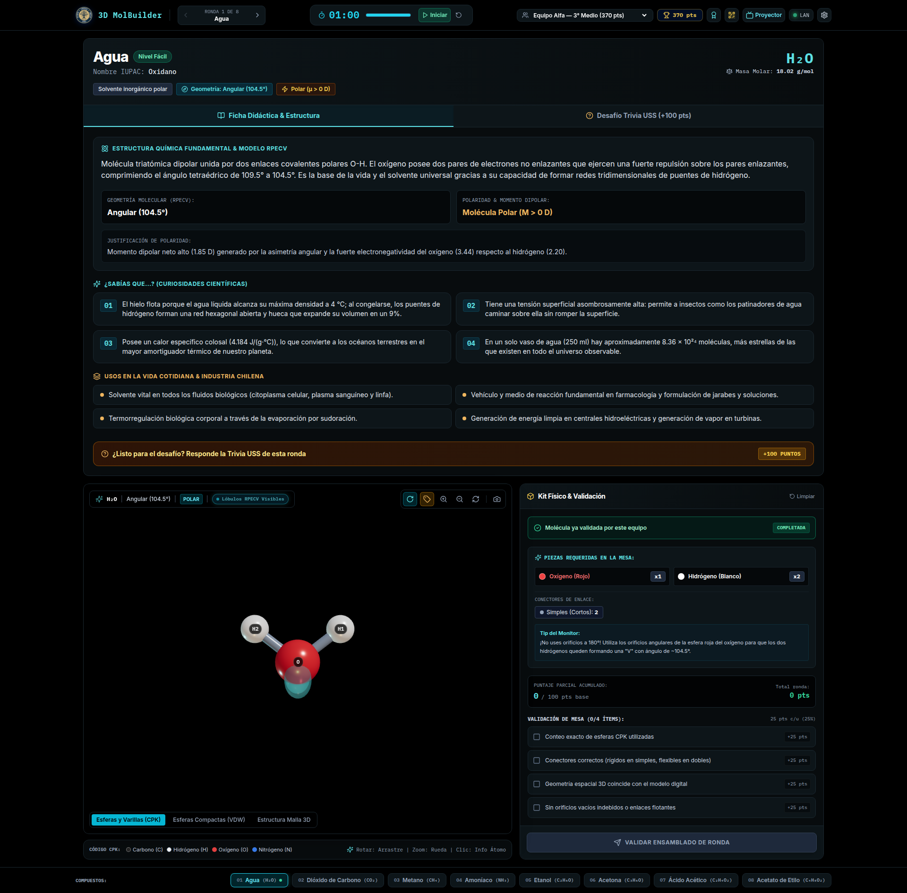

---

### 🎨 2. Modos de Renderizado Analítico Three.js (Preservación CPK Estricta)
El usuario puede alternar instantáneamente entre 3 representaciones espaciales para explorar diferentes conceptos químicos:

| Esferas y Varillas (CPK) | Espacio Lleno (Van der Waals) | Malla Alámbrica 3D (Geometría y Simetría) |
| :---: | :---: | :---: |
|  | 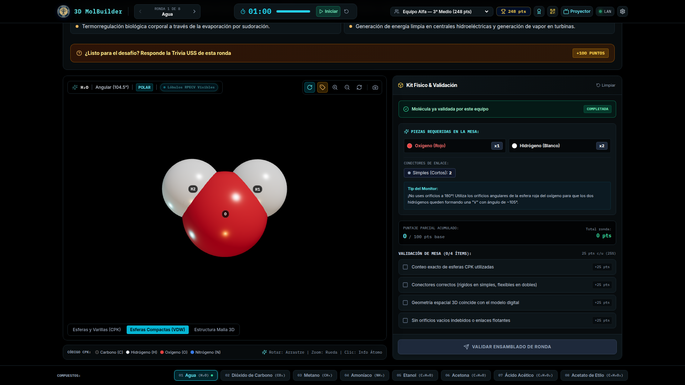 | 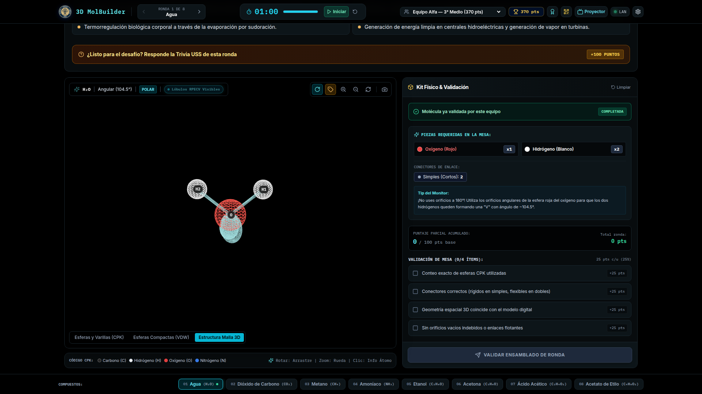 |
| *Enlaces analíticos por cuaterniones y esferas atómicas proporcionales.* | *Volúmenes de exclusión estérica basados en radios de van der Waals.* | *Estructura poligonal para análisis de ejes y planos de simetría.* |

---

### ⚛️ 3. Lóbulos de Densidad Electrónica RPECV & Desafíos Complejos
Representación física volumétrica de pares de electrones no enlazantes (`MeshPhysicalMaterial` translúcido) y recorrido hacia moléculas orgánicas de mayor complejidad estructural:

| Amoníaco ($\text{NH}_3$) — Lóbulo RPECV Apical ($107.3^\circ$) | Desafío Final: Acetato de Etilo ($\text{C}_4\text{H}_8\text{O}_2$) |
| :---: | :---: |
| 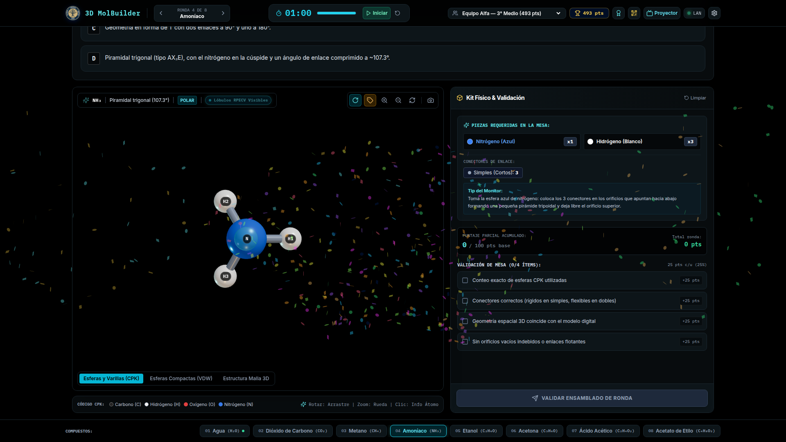 | 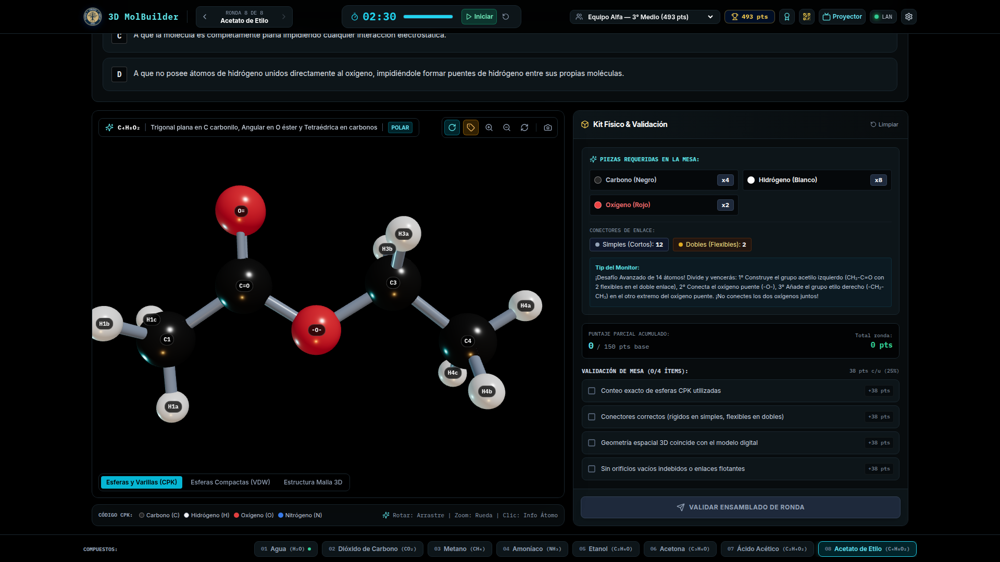 |
| *Visualización del par libre apical que deforma la geometría tetraédrica a piramidal trigonal.* | *Estructura éster con enlace doble $\text{C=O}$, hibridaciones $sp^2$/$sp^3$ y ángulo de torsión.* |

---

### 🎯 4. Gamificación Justa: Validación Proporcional del Kit Físico (25% por Casilla)
Para evitar la frustración de los estudiantes en mesa, el sistema evalúa el armado del kit físico de forma matemática e incremental: exactamente **+25% del puntaje base** por cada una de las 4 condiciones verificadas:

| 1 Casilla Verificada (+25 pts) | 2 Casillas Verificadas (+50 pts) | Kit Completo (+100 pts) |
| :---: | :---: | :---: |
| 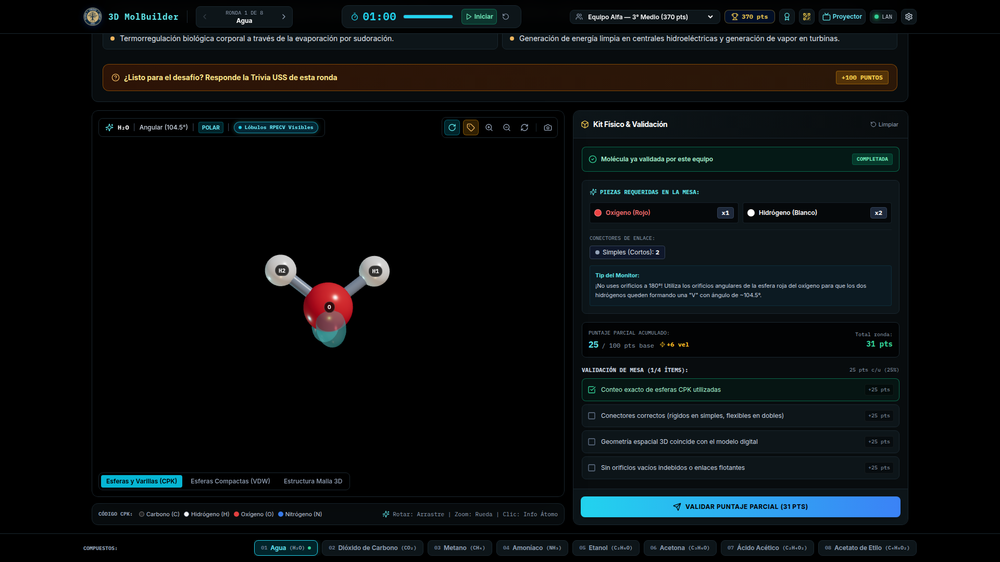 | 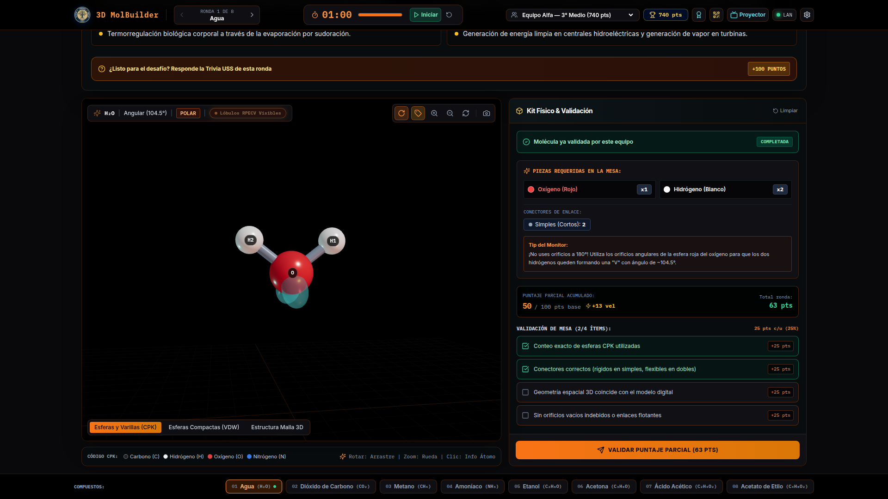 | 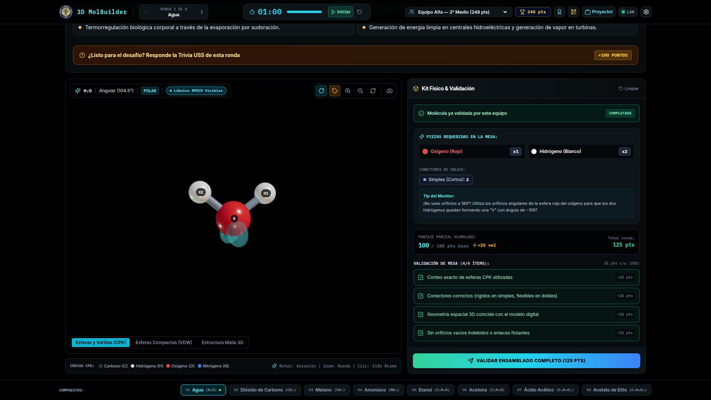 |
| *Conteo exacto de átomos verificado.* | *Conectores y enlaces correctos validados.* | *Geometría espacial 3D y kit sin orificios vacíos.* |

---

### 💡 5. Trivia Conceptual PAES USS & Fanfarria Triunfal
Cada ronda cuenta con un desafío teórico alineado con la prueba PAES y el currículo nacional chileno, con retroalimentación inmediata y celebración audiovisual en caso de acierto:

| Trivia Conceptual USS con Explicación Didáctica (+100 pts) | Modal de Trofeo, Desglose de Puntos y Confeti Digital |
| :---: | :---: |
| 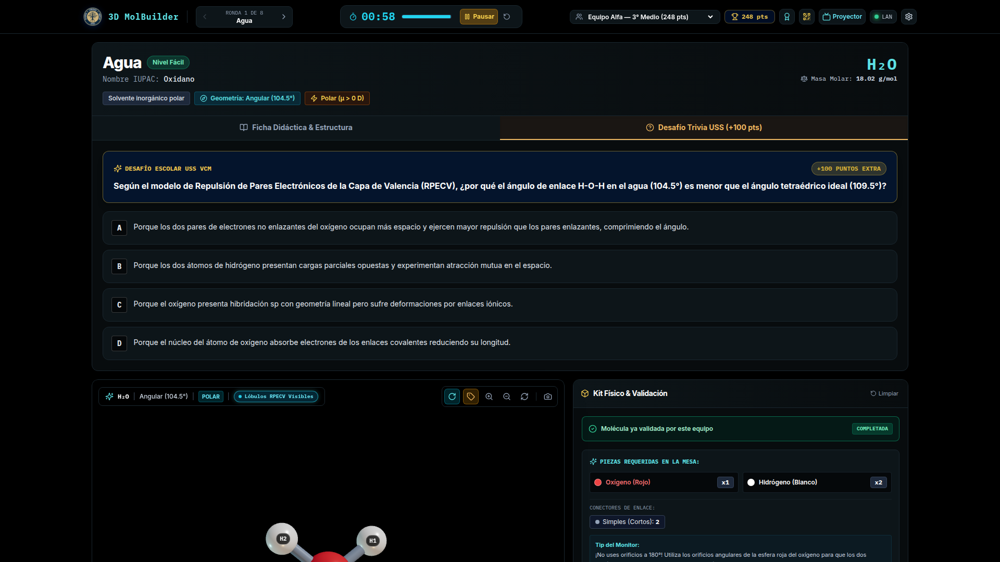 | 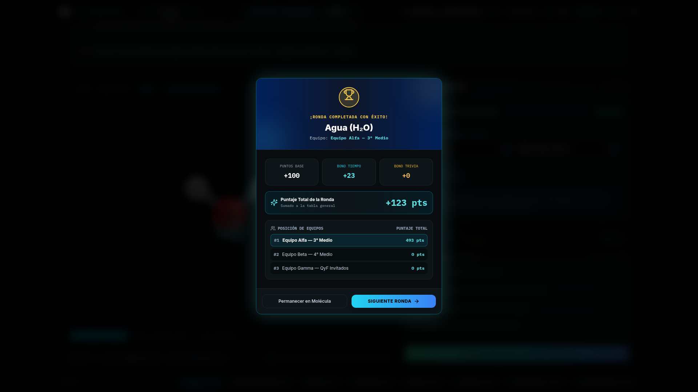 |
| *Explicación química fundamentada sin spoilers y distribución balanceada.* | *Desglose de bonificaciones de tiempo y trivia con síntesis de audio Web Audio API.* |

---

### 📊 6. Pantalla Master para Auditorio (1080p) & Responsividad Escolar (1366 × 768)

| Marcador Central Proyector Auditorio (1080p Full HD) | Adaptación Fluida en Notebooks Escolares (1366 × 768) |
| :---: | :---: |
| 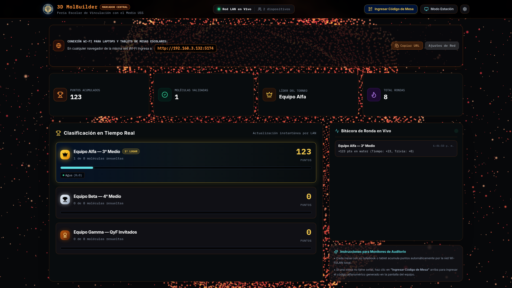 | 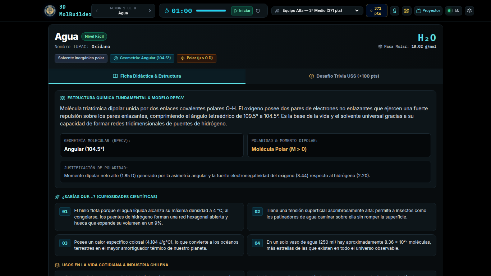 |
| *Ranking de equipos en tiempo real, bitácora de eventos y control de sincronización LAN.* | *Layout responsivo con glassmorphism adaptativo para pantallas de notebooks estándar de colegios.* |

---

## ⚡ Características Técnicas Principales

### 1. 🎨 Visor Gráfico 3D Analítico (Three.js) & Preservación CPK
- **3 Modos de Renderizado Dinámico:**
  - **Esferas y Varillas (CPK):** Modelado proporcional con enlaces analíticos calculados por orientación de cuaterniones.
  - **Espacio Lleno (Van der Waals):** Esferas aumentadas según sus radios atómicos de van der Waals relativos para ilustrar volumen de exclusión estérico.
  - **Malla Alámbrica 3D (Wireframe):** Estructura poligonal geométrica para análisis de simetría y ejes de enlace.
- **Código Cromático Internacional CPK Estricto:**
  - Carbono (Gris carbón `#262626`)
  - Hidrógeno (Blanco `#FFFFFF`)
  - Oxígeno (Rojo brillante `#EF4444`)
  - Nitrógeno (Azul cobalto `#3B82F6`)
  - Cloro (Verde esmeralda `#10B981`)
  - Azufre (Amarillo ámbar `#F59E0B`)
- **Lóbulos de Densidad Electrónica RPECV (VSEPR):** Visualización volumétrica de pares de electrones no enlazantes mediante mallas translúcidas cian (`#5de1e5`, `MeshPhysicalMaterial`), ilustrando el par solitario apical en $\text{NH}_3$ y los dos pares tetraédricos en $\text{H}_2\text{O}$ con repulsión angular ($107.3^\circ$ y $114.0^\circ$ según la teoría Nyholm-Gillespie).
- **Inspección Atómica con Raycasting:** Detección de clics en tiempo real para consultar el símbolo químico, radio covalente e hibridación orbital ($sp^3$, $sp^2$, $sp$).
- **Optimización de Rendimiento DOM:** Posicionamiento de etiquetas atómicas 2D desacoplado de React mediante manipulación directa de la propiedad `transform` del DOM (`labelNodesRef`), manteniendo la CPU bajo el 1%.
- **Liberación de Memoria WebGL:** Rutina `disposeHierarchy(obj)` que destruye geometrías, materiales y texturas al cambiar de compuesto.

### 2. 🌌 Fondo Procedural 3D (`RecursiveErosionBackground`) & Estética OLED
- **Campo de 22.000 Partículas en Tiempo Real:** 14.000 partículas en la esfera de erosión fractal orgánica (fBm invertido en GLSL) y 8.000 partículas en el halo cósmico orbital de baja latencia.
- **Paleta de Alta Gama:** Negro OLED (`#09090b`), Carbón Mate (`#18181b`), paneles en vidrio esmerilado translúcido (`rgba(18, 18, 22, 0.85)` con `backdrop-blur-md`) y bordes en Naranja Ámbar PIDE (`#F97316` / `#EA580C`).
- **Arquitectura Híbrida Offline:** Ejecución fluida en Three.js con fallback automático a sombreadores WebGL 1.0 nativos si el dispositivo carece de conexión a internet.
- **Eficiencia Energética:** Detección automática del ciclo de vida de la pestaña (`document.hidden`) para suspender el bucle de render y conservar batería en notebooks escolares.

### 3. 🎯 Gamificación Escolar y Rigor Pedagógico
- **Ficha Didáctica Amplia:** Sección continua sin compresión vertical que detalla la descripción química fundamental, modelo RPECV, clasificación de polaridad rigurosa con notación en Debye ($\mu > 0\text{ D}$ / $\mu = 0\text{ D}$), momentos dipolares experimentales, curiosidades del mundo real y aplicaciones en la industria chilena (vitivinícola, hidroeléctrica, agroindustrial).
- **Validación Matemática Proporcional del Kit Físico:** Sistema de puntaje que otorga exactamente el **25%** del puntaje base por cada hito verificado en mesa (25%, 50%, 75%, 100%), evitando la frustración escolar y fomentando la resolución incremental.
- **Trivia Escolar USS:** Desafíos conceptuales alineados con el currículo nacional chileno y la prueba PAES, con distribución equitativa de alternativas correctas (A, B, C, D) y bonificación de **+100 puntos**.
- **Audio Sintetizado Offline (Web Audio API):** Ticks de advertencia en los últimos 5 segundos, acordes armónicos de acierto en trivia y fanfarria triunfal de victoria con confeti animado, sin requerir descarga de archivos `.mp3` externos.

---

## 🔬 Dataset Molecular Oficial (`moleculesDataset.ts`)

Todas las masas molares están calculadas con base en los pesos atómicos estándar de la **IUPAC / CIAAW** ($H = 1.008$, $C = 12.011$, $N = 14.007$, $O = 15.999$):

| # | Compuesto | Fórmula | Masa Molar | Geometría RPECV | Momento Dipolar ($\mu$) | Dificultad | Tiempo | Enlaces Requeridos en Kit Físico |
| :-: | :--- | :---: | :---: | :---: | :---: | :---: | :---: | :--- |
| **01** | **Agua** | $\text{H}_2\text{O}$ | $18.015\text{ g/mol}$ | Angular ($104.5^\circ$, $LP-LP = 114.0^\circ$) | Polar ($\mu = 1.85\text{ D}$) | Fácil | 60s | 2 enlaces simples (conectores rígidos) |
| **02** | **Dióxido de Carbono** | $\text{CO}_2$ | $44.009\text{ g/mol}$ | Lineal ($180.0^\circ$) | Apolar ($\mu = 0.00\text{ D}$) | Fácil | 60s | 2 enlaces dobles ($\text{C=O}$, 4 conectores flexibles) |
| **03** | **Metano** | $\text{CH}_4$ | $16.043\text{ g/mol}$ | Tetraédrica ($109.5^\circ$) | Apolar ($\mu = 0.00\text{ D}$) | Fácil | 60s | 4 enlaces simples (conectores rígidos) |
| **04** | **Amoníaco** *(Bonus)* | $\text{NH}_3$ | $17.031\text{ g/mol}$ | Piramidal trigonal ($107.3^\circ$) | Polar ($\mu = 1.47\text{ D}$) | Fácil | 60s | 3 enlaces simples + lóbulo apical par solitario |
| **05** | **Etanol** | $\text{C}_2\text{H}_6\text{O}$ | $46.069\text{ g/mol}$ | Tetraédrica en C ($109.5^\circ$) / Angular en O ($104.5^\circ$) | Polar ($\mu = 1.69\text{ D}$) | Intermedio | 90s | 8 enlaces simples (cadena alifática + hidroxilo) |
| **06** | **Acetona** | $\text{C}_3\text{H}_6\text{O}$ | $58.080\text{ g/mol}$ | Trigonal plana en carbonilo ($120.0^\circ$) | Polar ($\mu = 2.88\text{ D}$) | Intermedio | 90s | 1 doble ($\text{C=O}$, 2 flexibles) + 8 simples |
| **07** | **Ácido Acético** *(Bonus)* | $\text{C}_2\text{H}_4\text{O}_2$ | $60.052\text{ g/mol}$ | Trigonal plana en carboxilo / Angular en -OH | Polar ($\mu = 1.74\text{ D}$) | Intermedio | 90s | 1 doble ($\text{C=O}$, 2 flexibles) + 6 simples |
| **08** | **Acetato de Etilo** | $\text{C}_4\text{H}_8\text{O}_2$ | $88.106\text{ g/mol}$ | Trigonal plana en éster / Tetraédrica en alquilos | Polar ($\mu = 1.78\text{ D}$) | Avanzado | 150s | 1 doble ($\text{C=O}$, 2 flexibles) + 12 simples |

---

## 🚀 Instalación y Puesta en Marcha

### Requisitos Previos:
- **Node.js:** >= 18.0.0
- **npm:** >= 9.0.0

### Ejecución Local en Desarrollo:
```bash
# 1. Clonar el repositorio
git clone https://github.com/moises-inc/3D-MolBuilder.git
cd 3D-MolBuilder

# 2. Instalar dependencias
npm install

# 3. Iniciar servidor Vite y Servidor Socket.io en paralelo
npm run dev

# 4. Modo LAN Multidispositivo (escuchando en todas las interfaces 0.0.0.0)
npm run dev:lan
```

- **Estación de Mesa Alumnos:** `http://localhost:5174/`
- **Marcador Central Proyector Auditorio:** `http://localhost:5174/?role=master`
- **Acceso desde Red Wi-Fi:** `http://<IP-SERVIDOR>:5174` (ej. `http://192.168.3.132:5174`)

### Compilación y Ejecución Unificada Offline (Puerto Único :3001):
```bash
# Compilar bundle estático optimizado
npm run build

# Iniciar servidor unificado Express/Socket.io sirviendo la carpeta dist/
npm start
```
Permite desplegar todo el ecosistema en un único puerto (`http://<IP-HOST>:3001/`) sin dependencias de desarrollo, ideal para ferias escolares en entornos sin conectividad a internet.

---

## 🌐 Sincronización en Tiempo Real (Red Escolar LAN & Respaldo QR)

1. **Sincronización WebSocket (Socket.io en `:3001`):** Actualización instantánea (< 5ms de latencia en LAN local) de puntuaciones, eventos de completitud de ronda y disparo de fanfarrias en la pantalla gigante del auditorio.
2. **Modo Respaldo Alfanumérico y Código QR (Zero-Risk Offline):** En recintos con restricciones de firewall o sin router local, cada mesa genera un código QR SVG y un identificador alfanumérico (ej. `ALFA-850`) que el monitor del taller puede ingresar en el proyector para acreditar los puntos de forma manual sin depender de la red.
3. **Resiliencia ante Fuzzing y Estrés de Concurrencia:** Servidor blindado contra caídas con 0 excepciones no capturadas ante payloads malformados, probado exitosamente bajo ráfagas de 50 estaciones concurrentes (`scripts/simulate_multi_device_lan_test.js`).

Consulta la **[Guía de Sincronización Multidispositivo](docs/multi_device_guide.md)** para detalles de configuración de red y topología en ferias.

---

## 🧪 Aseguramiento de Calidad y Suites de Prueba Automatizadas

El repositorio cuenta con dos suites de verificación automatizada:

### 1. Suite E2E en Navegador Real (Playwright Chromium)
```bash
node scripts/e2e_browser_test_vcm.js
```
- **Resultado Oficial:** **26 de 26 aserciones aprobadas (100% PASS)** evaluando las 8 rondas, cambio de modos Three.js, lóbulos RPECV, validación del kit 25/50/100%, trivia y pantalla master.
- **Evidencia Visual:** 24 capturas de pantalla de alta fidelidad sincronizadas en [`docs/vcm_qa_captures/`](docs/vcm_qa_captures/).
- **Reporte Técnico Consolidado:** Consulta el reporte completo en **[`qa_e2e_report.md`](qa_e2e_report.md)**.

### 2. Suite de Carga y Estrés Multi-Dispositivo LAN
```bash
# Fase 1: Carga estándar (10 mesas escolares)
node scripts/simulate_multi_device_lan_test.js 10 10

# Fase 2: Auditorio completo (25 mesas escolares)
node scripts/simulate_multi_device_lan_test.js 25 12

# Fase 3: Prueba de estrés extremo (50 mesas escolares)
node scripts/simulate_multi_device_lan_test.js 50 15
```
- **Resultado Oficial:** **0 crashes**, 100% de reconexión automática en caliente, 100% de tolerancia a fuzzing de payloads nulos y medición de latencia RTT de extremo a extremo.

---

## 📑 Documentación Técnica Completa

- 📊 **[Reporte de Auditoría E2E y Evaluación Técnica](qa_e2e_report.md)**
- 🏗️ **[Arquitectura de Software](docs/architecture.md)**
- 🌐 **[Guía de Sincronización Multidispositivo (LAN & QR)](docs/multi_device_guide.md)**
- 📖 **[Guía Didáctica y Manual del Monitor](docs/didactic_guide.md)**
- 🔬 **[Referencia de Coordenadas y Dataset Molecular](docs/dataset_reference.md)**

---

## ⚖️ Licencia y Derechos de Autor

Este proyecto está licenciado bajo la **[GNU Affero General Public License v3.0 (AGPLv3)](LICENSE)**.  
Copyright (C) 2026 Moisés Amundarain Romero, Gamaliel Cisternas Herrera, Diego Pavez Gallardo, Dra. Fabiola Acuña Sanhueza — Universidad San Sebastián (USS).
