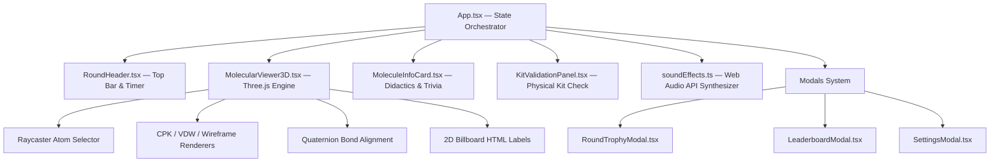

# Arquitectura de Software — 3D MolBuilder

---

## 🏛️ 1. Visión General de la Arquitectura

**3D MolBuilder** es una aplicación web desacoplada de PIDE Core, diseñada bajo principios de **autonomía 100% offline**, alto rendimiento gráfico 3D y diseño OLED Black. Fue concebida para operar sin conexión a internet en ferias y talleres de extensión científica universitaria con colegios de educación media.

---

## 🎨 2. Motor Gráfico 3D (`MolecularViewer3D.tsx`)

El motor gráfico 3D utiliza **Three.js** con `OrbitControls` (amortiguación suave con `enableDamping = true` y `dampingFactor = 0.05`) y ciclo de vida optimizado en React (`useRef` + `useEffect` deterministas).

### Features Gráficos Implementados:
1. **Materiales Físicos Orgánicos (`MeshPhysicalMaterial`):**
   Tanto las esferas de átomos como las varillas metálicas de enlace emplean `THREE.MeshPhysicalMaterial` con `roughness = 0.25`, `metalness = 0.1`, `clearcoat = 0.35` y `clearcoatRoughness = 0.15`, logrando reflejos orgánicos suaves, lustre nítido y máximo contraste sobre fondo OLED Black.

2. **Modelado Analítico de Enlaces (Cuaterniones):**
   Los enlaces entre átomos no se dibujan mediante coordenadas prefijadas, sino calculando el cuaternión de rotación $q$ entre el vector unitario $(0,1,0)$ y el vector de dirección entre las dos posiciones atómicas $\vec{d} = \vec{p}_2 - \vec{p}_1$:
   $$q = \text{QuaternionFromUnitVectors}((0,1,0), \hat{d})$$
   Para enlaces dobles (ej. $C=O$ en acetona, ácido acético o $\text{CO}_2$), se aplican desplazamientos perpendiculares analíticos para renderizar dos cilindros paralelos paralelos al eje del enlace.

3. **Modos de Renderizado Dinámico:**
   - **Esferas y Varillas (CPK):** Esferas en escala CPK oficial con cilindros enlazantes.
   - **Espacio Lleno (Van der Waals):** Esferas aumentadas al 220% de su radio atómico relativo para mostrar volumen estérico de empaquetamiento.
   - **Malla Alámbrica 3D (Wireframe):** Estructuras alámbricas translúcidas de alta frecuencia poligonal.

4. **Raycasting & Inspección Atómica:**
   Detección de clics mediante `THREE.Raycaster` sobre la geometría de los átomos para resaltar el objeto seleccionado con un aura cromática (Cyan `#5de1e5`) y proyectar su hibridación, símbolo y estado en la interfaz.

5. **Exportación de Capturas PNG HD:**
   Un botón directo invoca `webglRenderer.domElement.toDataURL('image/png')` para generar imágenes de la molécula 3D en alta resolución sin necesidad de capturas de pantalla externas.

---

## 🔊 3. Motor de Audio Sintetizado Offline (`soundEffects.ts`)

Para evitar la carga de assets pesados o dependencias de red, el sistema utiliza **Web Audio API** nativa del navegador:

- **Desbloqueo de Autoplay (`unlockAudio()`):** Detecta el primer gesto del usuario (`click`, `pointerdown`, `keydown`) en `App.tsx` para reanudar de forma transparente el `AudioContext` suspendido por el navegador.
- **Ticks de Temporizador (`playTick()`):** Oscilador senoidal a 600 Hz con envolvente exponencial suave (80 ms) que suena en los últimos 5 segundos de cada ronda.
- **Fanfarria de Victoria (`playSuccess()`):** Arpegio ascendente sintetizado ($C_5 \rightarrow E_5 \rightarrow G_5 \rightarrow C_6$) mediante osciladores triangulares (`triangle`) para celebrar la validación del kit físico.
- **Acierto en Trivia (`playTriviaCorrect()`):** Acorde mayor triádico brillante ($A_4 \rightarrow C^\sharp_5 \rightarrow E_5$) con onda senoidal para retroalimentar respuestas correctas (+100 pts).

---

## ⚙️ 4. Verificación y Calidad de Código

El repositorio cumple con los estándares estrictos de compilación:
- `tsc -b`: Validación estricta del compilador TypeScript sin tipos `any` ni advertencias.
- `vite build`: Generación de bundles minificados en `dist/` con precarga de módulos de Three.js y React 19.
