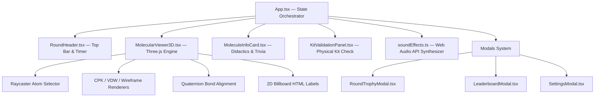

# Arquitectura de Software — 3D MolBuilder

---

## 🏛️ 1. Visión General de la Arquitectura

**3D MolBuilder** es una aplicación web desacoplada de PIDE Core, diseñada bajo principios de **autonomía 100% offline**, alto rendimiento gráfico 3D y diseño OLED Black. Fue concebida para operar sin conexión a internet en ferias y talleres de extensión científica universitaria con colegios de educación media.

---

## 🎨 2. Motor Gráfico 3D (`MolecularViewer3D.tsx`)

El motor gráfico 3D utiliza **Three.js** con `OrbitControls` (amortiguación suave con `enableDamping = true` y `dampingFactor = 0.05`) y ciclo de vida optimizado en React (`useRef` + `useEffect` deterministas).

### Features Gráficos Implementados:
1. **Materiales Físicos Orgánicos (`MeshPhysicalMaterial`):**
   Tanto las esferas de átomos como las varillas metálicas de enlace emplean `THREE.MeshPhysicalMaterial` con `roughness = 0.25`, `metalness = 0.1`, `clearcoat = 0.35` y `clearcoatRoughness = 0.15`, logrando reflejos orgánicos suaves, lustre nítido y máximo contraste sobre fondo OLED Black.

2. **Modelado Analítico de Enlaces (Cuaterniones):**
   Los enlaces entre átomos no se dibujan mediante coordenadas prefijadas, sino calculando el cuaternión de rotación $q$ entre el vector unitario $(0,1,0)$ y el vector de dirección entre las dos posiciones atómicas $\vec{d} = \vec{p}_2 - \vec{p}_1$:
   $$q = \text{QuaternionFromUnitVectors}((0,1,0), \hat{d})$$
   Para enlaces dobles (ej. $C=O$ en acetona, ácido acético o $\text{CO}_2$), se aplican desplazamientos perpendiculares analíticos para renderizar dos cilindros paralelos paralelos al eje del enlace.

3. **Modos de Renderizado Dinámico:**
   - **Esferas y Varillas (CPK):** Esferas en escala CPK oficial con cilindros enlazantes.
   - **Espacio Lleno (Van der Waals):** Esferas aumentadas al 220% de su radio atómico relativo para mostrar volumen estérico de empaquetamiento.
   - **Malla Alámbrica 3D (Wireframe):** Estructuras alámbricas translúcidas de alta frecuencia poligonal.

4. **Lóbulos de Densidad Electrónica no Enlazantes RPECV (VSEPR):**
   Renderizado volumétrico dinámico para compuestos con pares solitarios clave:
   - **Material Translúcido:** `THREE.MeshPhysicalMaterial` con tinte Cyan PIDE (`#5de1e5`), `opacity = 0.40`, `roughness = 0.2`, `metalness = 0.05` y `transmission = 0.3`.
   - **Amoníaco ($\text{NH}_3$):** 1 lóbulo apical elipsoidal deformado sobre el nitrógeno en $+Z$ opuesto a los tres enlaces $\text{N-H}$, evidenciando la repulsión tripoidal ($107.3^\circ$).
   - **Agua ($\text{H}_2\text{O}$):** 2 lóbulos tetraédricos sobre el oxígeno en el plano $YZ$ opuestos a los enlaces $\text{O-H}$, ilustrando la compresión angular a $104.5^\circ$.
   - **Indicador HUD:** Badge flotante interactivo indicando *"Lóbulos RPECV Visibles"*.

5. **Raycasting & Inspección Atómica:**
   Detección de clics mediante `THREE.Raycaster` sobre la geometría de los átomos para resaltar el objeto seleccionado con un aura cromática (Cyan `#5de1e5`) y proyectar su hibridación, símbolo y estado en la interfaz.

6. **Exportación de Capturas PNG HD:**
   Un botón directo invoca `webglRenderer.domElement.toDataURL('image/png')` para generar imágenes de la molécula 3D en alta resolución sin necesidad de capturas de pantalla externas.

---

## 📐 3. Rediseño de Layout Dual y Validación Progresiva

1. **Layout Dual Optimizado para Proyector Escolar:**
   - **Zona Superior Didáctica:** Tarjeta horizontal continua que consolida propiedades físicas, fórmulas con subíndices UTF-8, modelo RPECV, curiosidades del mundo real y la pestaña de **Trivia Escolar USS** (8 preguntas calibradas para 3° y 4° Medio con balance homogéneo de opciones A, B, C, D).
   - **Zona Inferior de Ejecución:** Escenario 3D interactivo a la izquierda (con leyenda CPK y controles orbitales) y panel de validación de kit físico a la derecha.

2. **Panel de Validación del Kit Físico y Puntuación Parcial:**
   - **Aislamiento de Estado por Molécula:** Limpieza automática de casillas (`useEffect` en `molecule.id`) evitando el marcado masivo accidental.
   - **Puntuación Proporcional:** 25% del puntaje base por cada criterio verificado (esferas, conectores, geometría, sin piezas sueltas).
   - **Bonificación Dinámica de Velocidad:** Otorga entre +1 y +25 puntos adicionales en función del tiempo restante de la ronda.

---

## 🔊 4. Motor de Audio Sintetizado Offline (`soundEffects.ts`)

Para evitar la carga de assets pesados o dependencias de red, el sistema utiliza **Web Audio API** nativa del navegador:

- **Desbloqueo de Autoplay (`unlockAudio()`):** Detecta el primer gesto del usuario (`click`, `pointerdown`, `keydown`) en `App.tsx` para reanudar de forma transparente el `AudioContext` suspendido por el navegador.
- **Ticks de Temporizador (`playTick()`):** Oscilador senoidal a 600 Hz con envolvente exponencial suave (80 ms) que suena en los últimos 5 segundos de cada ronda.
- **Fanfarria de Victoria (`playSuccess()`):** Arpegio ascendente sintetizado ($C_5 \rightarrow E_5 \rightarrow G_5 \rightarrow C_6$) mediante osciladores triangulares (`triangle`) para celebrar la validación del kit físico.
- **Acierto en Trivia (`playTriviaCorrect()`):** Acorde mayor triádico brillante ($A_4 \rightarrow C^\sharp_5 \rightarrow E_5$) con onda senoidal para retroalimentar respuestas correctas (+100 pts).

---

## ⚙️ 5. Verificación y Calidad de Código

El repositorio cumple con los estándares estrictos de compilación:
- `tsc -b`: Validación estricta del compilador TypeScript sin tipos `any` ni advertencias.
- `vite build`: Generación de bundles minificados en `dist/` con precarga de módulos de Three.js y React 19.

---

## 🌌 6. Sistema de Fondo Dinámico 3D (`RecursiveErosionBackground`) & Estética OLED / Ámbar

Para dotar a la plataforma de una estética sobria de grado científico y alta gama visual, se integró el motor procedural `RecursiveErosionBackground`:

1. **Simulación Procedural de 22.000 Partículas:**
   - **Esfera de Erosión Recursiva (14.000 partículas):** Mapeo esférico de Fibonacci deformado dinámicamente mediante ruido fractal Simplex 3D (fBm invertido) en GLSL.
   - **Halo Cósmico Orbital (8.000 partículas):** Distribución elíptica extendida que enmarca el viewport y rota suavemente en el eje $Y$, respondiendo de manera fluida al cursor del mouse.
2. **Arquitectura Híbrida Three.js + WebGL Nativo:**
   - Si Three.js está cargado, utiliza un `THREE.ShaderMaterial` con `blending: THREE.AdditiveBlending`.
   - Si se opera en aulas completamente desconectadas sin acceso al CDN, conmuta automáticamente a un sombreador WebGL 1.0 nativo de cero dependencias externas.
3. **Resolución de Stacking Context:**
   - Montado a través de un `iframe` seguro (`sandbox="allow-scripts allow-same-origin"`) fijado en `fixed inset-0 pointer-events-none z-0`.
   - Los contenedores raíz de la aplicación (`App.tsx` y `ProjectorView.tsx`) operan con `bg-transparent`, permitiendo que el lienzo negro OLED (`#09090b`) de `index.html` sirva de base y las partículas ámbar destellen detrás de los paneles con glassmorphism (`backdrop-blur-md`).
4. **Optimización Energética:**
   - Listener de `visibilitychange` (`document.hidden`) que suspende automáticamente el ciclo `requestAnimationFrame` cuando el navegador pasa a segundo plano o se minimiza.

---

## 🧪 7. Suite de Pruebas Automatizadas E2E en Navegador Real (`scripts/e2e_browser_test_vcm.js`)

Se desarrolló una suite de aseguramiento de calidad (QA) determinista basada en **Playwright Chromium**:
- **26 Aserciones Automatizadas (100% PASS):** Evaluación secuencial de los 8 compuestos, modos Three.js (CPK, VDW, Malla), lóbulos RPECV, validación proporcional del kit (25%, 50%, 75%, 100%), trivias escolares, fanfarria modal, vista de proyector master 1080p y adaptación responsiva a notebooks escolares (1366x768).
- **Evidencia Fotográfica de Alta Definición:** Generación de 24 capturas PNG en `docs/vcm_qa_captures/` y reporte de métricas en `docs/vcm_qa_captures/e2e_summary.json`.
- **Integración con PIDE Core:** Validación del acceso directo cruzado desde la barra lateral de PIDE (`:5173`) hacia el taller molecular 3D (`:5174`).

