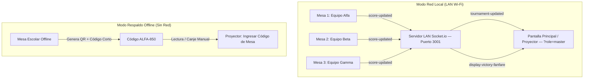

# Guía de Sincronización Multidispositivo — 3D MolBuilder

**Universidad San Sebastián (USS) — Vinculación con el Medio (VcM)**  
**Taller de Armado Molecular 3D y Ferias Científicas Escolares**

---

## 🌐 1. Visión General del Sistema Multidispositivo

Para las ferias escolares de Vinculación con el Medio (VcM USS), **3D MolBuilder** cuenta con una arquitectura de sincronización híbrida diseñada para operar en entornos con o sin infraestructura de red:



### Roles de Pantalla:
1. 🖥️ **Modo Estación de Mesa:**
   - Visualización interactiva 3D de la molécula por ronda (Three.js con códigos CPK).
   - Ficha didáctica, curiosidades y trivia química (+100 pts).
   - Checklist de verificación y conteo de piezas del kit físico de mesa.
   - Envío automático de puntaje por red local y generación de código de respaldo QR.

2. 📊 **Modo Proyector Principal / Marcador Central:**
   - Tablero de clasificación general en tiempo real (Leaderboard gigante).
   - Barras de progreso por equipo y badges de moléculas completadas.
   - Bitácora de eventos y actividades en vivo.
   - Efectos de celebración con confeti digital a pantalla completa y fanfarria sonora.
   - Ventana de canje manual para códigos de mesa y QR sin conexión.

---

## 🚀 2. Puesta en Marcha en el Evento (Paso a Paso)

### Opción A: Modo Red LAN Wi-Fi (Recomendado)

1. **Conectar todos los equipos a la misma red Wi-Fi o Router Local:**
   - Puedes utilizar un router portátil, la red Wi-Fi de la sede universitaria o compartir internet/zona Wi-Fi desde un teléfono o notebook central.
   
2. **Iniciar el Servidor y la Aplicación en el PC Central:**
   En la consola del computador conectado al proyector, ejecuta:
   ```bash
   cd 3D-MolBuilder
   npm run dev:lan
   ```
   La consola imprimirá un banner informativo indicando la IP de la red local:
   ```text
   📡 Puerto del Servidor Socket.io: 3001
   🌐 Direcciones LAN disponibles para conectar mesas y proyector:
      👉 http://192.168.3.132:3001
      👉 Cliente Web Vite: http://192.168.3.132:5174
   ```

3. **Abrir el Proyector en el PC Central:**
   Abre el navegador en el PC del proyector y navega a:
   ```text
   http://localhost:5174/?role=master
   ```
   (O haz clic en el botón `"Proyector"` en la barra superior).

4. **Conectar los Notebooks / Tablets de las Mesas:**
   En cada mesa de estudiantes, abre el navegador web e ingresa la dirección IP del PC central:
   ```text
   http://192.168.3.132:5174
   ```
   - Cada mesa selecciona su equipo en el menú desplegable (ej. *Equipo Alfa*, *Equipo Beta*, etc.).
   - El indicador LED de la barra superior cambiará a 🟢 **LAN** (Verde), confirmando conexión en tiempo real con el marcador central.

---

## 🧪 3. Protocolo de Pruebas Rápidas en una Sola Máquina

Puedes simular el entorno del torneo abriendo **dos pestañas** en tu navegador:

1. **Pestaña 1 (Proyector):**
   - Abre `http://localhost:5174/?role=master`.
   - Observarás el Marcador Central con el podio de los 3 equipos y la bitácora vacía.

2. **Pestaña 2 (Mesa 1):**
   - Abre `http://localhost:5174/`.
   - Selecciona `"Equipo Alfa"` en el selector de equipos.
   - Responde la Trivia (+100 pts) y valida el armado de la primera molécula (Agua).
   - Regresa a la **Pestaña 1**: ¡Verás cómo el puntaje del Equipo Alfa se actualiza inmediatamente en el proyector, la barra de progreso avanza, aparece el evento en la bitácora y se desata la fanfarria de victoria con confeti!

---

## 📴 4. Modo Respaldo Sin Red Wi-Fi (QR & Código Corto)

Si en el colegio o recinto ferial no hay señal Wi-Fi o se produce una caída de red:

1. El indicador LED de la barra superior cambiará a 🟡 **QR** (Amarillo / Modo Offline).
2. **Generación del Código en la Mesa:**
   - Al validar la molécula en la mesa o al pulsar el botón `QR Mesa` en la barra superior, se abrirá la ventana con:
     - **Código QR SVG** dinámico conteniendo la firma de la ronda.
     - **Código Corto de 6 caracteres** (ej. `ALFA-850`, `BETA-600`).
3. **Acreditación en la Pantalla Principal:**
   - El monitor o capitán de mesa se acerca al computador del proyector.
   - En la pantalla del proyector, se pulsa el botón **`"Ingresar Código de Mesa"`**.
   - Se digita el código corto (ej. `ALFA-850`) o se pega el contenido del QR.
   - Al presionar **`"Acreditar Puntos al Marcador"`**, los puntos se acreditan inmediatamente al equipo correspondiente y se reproduce la celebración.

---

## ⚙️ 5. Configuración y Puertos del Sistema

| Componente | Archivo de Código | Puerto Predeterminado | Protocolo / Función |
| :--- | :--- | :---: | :--- |
| **Cliente Web Vite** | [`config/vite.config.ts`](../config/vite.config.ts) | `5174` | HTTP / HMR / Proxy WebSocket transparente a `3001` (`host: 0.0.0.0`) |
| **Servidor Socket.io / API** | [`server/index.js`](../server/index.js) | `3001` | WebSockets / HTTP Polling / Servidor de producción autónomo |
| **Gestor de Sincronización** | [`src/utils/socketSync.ts`](../src/utils/socketSync.ts) | N/A | Detección automática de origen, fallback dinámico y reconexión infinita |
| **Componente Proyector** | [`src/components/ProjectorView.tsx`](../src/components/ProjectorView.tsx) | N/A | Pantalla principal con banner de URL de mesas y control central |
| **Modal de Ajustes y Red** | [`src/components/SettingsModal.tsx`](../src/components/SettingsModal.tsx) | N/A | Selector de roles, diagnósticos de enlace LAN e input de IP manual |
| **Modal Respaldo QR** | [`src/components/SyncQRModal.tsx`](../src/components/SyncQRModal.tsx) | N/A | Respaldo fuera de línea por código QR SVG y claves de 6 caracteres |

---

## 🛠️ 6. Guía de Solución de Problemas en Redes Wi-Fi (Troubleshooting)

Si realizaste pruebas con dos laptops en la misma red Wi-Fi y no lograste conexión, revisa los siguientes escenarios habituales:

### Escenario 1: La página web no carga en la segunda laptop (`ERR_CONNECTION_REFUSED` o `Timeout`)
1. **Verifica la dirección y el puerto exacto:**
   - Asegúrate de ingresar el puerto **`5174`** (ejemplo: `http://192.168.1.50:5174`), no `5174` ni `3000`.
   - Confirma la IP del computador central mirando el banner en la terminal donde se ejecutó `npm run dev:lan` (el servidor ahora clasifica y resalta la IP `[Wi-Fi 📶]` para distinguirla de VPNs como Tailscale o Docker).
2. **Firewall del Sistema Operativo en el PC Servidor:**
   - En **Linux (Ubuntu/Debian):** Si tienes `ufw` activo, permite los puertos ejecutando:
     ```bash
     sudo ufw allow 5174/tcp
     sudo ufw allow 3001/tcp
     ```
   - En **Windows:** Al iniciar Node.js por primera vez, Windows Defender suele preguntar si deseas permitir el acceso en redes públicas/privadas. Asegúrate de marcar ambas casillas o agregar una regla de entrada para el puerto `5174`.

### Escenario 2: La página carga, pero el indicador permanece en 🟡 "QR / Offline"
1. **Configuración manual de IP desde la interfaz:**
   - Haz clic directamente en el indicador **`🟡 QR`** de la barra superior (o en el engranaje de **Configuración**).
   - En la sección **"Sincronización Multidispositivo & Red Wi-Fi"**, escribe la IP del PC central en el campo *"Dirección IP / Servidor del PC Central"* (ej. `192.168.1.50:5174` o `192.168.1.50:3001`) y presiona **"Conectar"**.
   - El cliente persistirá la IP en `localStorage` y se conectará al instante.
2. **Aislamiento de Clientes en la Red Wi-Fi (AP Isolation / Guest Network):**
   - En redes universitarias (como eduroam o redes de invitados) o routers institucionales, suele estar activada la función **AP Isolation** (Aislamiento de Punto de Acceso), la cual impide que dos dispositivos conectados a la misma antena Wi-Fi se vean o comuniquen entre sí.
   - **Solución Rápida y Efectiva:** Activa la **Zona Wi-Fi Portátil / Compartir Internet (Hotspot)** desde un teléfono móvil o desde una de las laptops. Conecta ambas laptops a esa red compartida. Las zonas Wi-Fi móviles no tienen aislamiento de clientes y funcionan de manera inmediata y estable.

### Escenario 3: Ambas laptops ejecutaron `npm run dev` localmente
- Si clonaste el proyecto en las dos laptops y abriste `http://localhost:5174` en ambas, cada laptop se conectará a su propio servidor local independiente y no se comunicarán.
- **Solución:** En la laptop de la mesa, abre `SettingsModal` (icono de engranaje o clic en `QR`), ingresa la IP del PC proyector y presiona **"Conectar"**, o simplemente abre en el navegador la dirección de red del proyector: `http://<IP-PC-PROYECTOR>:5174`.

### Escenario 4: Modo Producción Autónomo (Un Solo Puerto `3001`)
- Puedes compilar la aplicación y servirla en un único puerto unificado sin dependencias de desarrollo:
  ```bash
  npm run build
  npm start
  ```
- El servidor Express alojará la interfaz web estática y el servidor Socket.io simultáneamente en el puerto **`3001`**:
  `http://<IP-DEL-PC>:3001/`

---

## 🧪 7. Suite de Carga y Estrés Multi-Dispositivo LAN (`simulate_multi_device_lan_test.js`)

El repositorio incluye un arnés de pruebas automatizadas para simular hasta 50 estaciones concurrentes transmitiendo ráfagas de puntajes en tiempo real hacia la pantalla master:

```bash
# Fase 1: Carga estándar (10 mesas escolares)
node scripts/simulate_multi_device_lan_test.js 10 10

# Fase 2: Auditorio completo (25 mesas escolares)
node scripts/simulate_multi_device_lan_test.js 25 12

# Fase 3: Estrés extremo (50 mesas escolares concurrentes)
node scripts/simulate_multi_device_lan_test.js 50 15
```

### Capacidades Verificadas:
- **Resistencia a Fuzzing:** Emisión intencionada de payloads nulos y malformados en `score-updated` y `redeem-code` sin caídas de servidor (**0 crashes / 100% uptime**).
- **Tolerancia a Desconexiones:** Simulación de desconexión abrupta en caliente con reconexión automática en menos de 1 segundo.
- **Telemetría RTT de Extremo a Extremo:** Medición precisa del tiempo de propagación entre la emisión de puntaje en la mesa y la actualización visual en la pantalla master.

