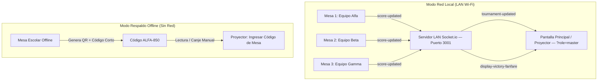

# Guía de Sincronización Multidispositivo — 3D MolBuilder

**Universidad San Sebastián (USS) — Vinculación con el Medio (VcM)**  
**Taller de Armado Molecular 3D y Ferias Científicas Escolares**

---

## 🌐 1. Visión General del Sistema Multidispositivo

Para las ferias escolares de Vinculación con el Medio (VcM USS), **3D MolBuilder** cuenta con una arquitectura de sincronización híbrida diseñada para operar en entornos con o sin infraestructura de red:



### Roles de Pantalla:
1. 🖥️ **Modo Estación de Mesa:**
   - Visualización interactiva 3D de la molécula por ronda (Three.js con códigos CPK).
   - Ficha didáctica, curiosidades y trivia química (+100 pts).
   - Checklist de verificación y conteo de piezas del kit físico de mesa.
   - Envío automático de puntaje por red local y generación de código de respaldo QR.

2. 📊 **Modo Proyector Principal / Marcador Central:**
   - Tablero de clasificación general en tiempo real (Leaderboard gigante).
   - Barras de progreso por equipo y badges de moléculas completadas.
   - Bitácora de eventos y actividades en vivo.
   - Efectos de celebración con confeti digital a pantalla completa y fanfarria sonora.
   - Ventana de canje manual para códigos de mesa y QR sin conexión.

---

## 🚀 2. Puesta en Marcha en el Evento (Paso a Paso)

### Opción A: Modo Red LAN Wi-Fi (Recomendado)

1. **Conectar todos los equipos a la misma red Wi-Fi o Router Local:**
   - Puedes utilizar un router portátil, la red Wi-Fi de la sede universitaria o compartir internet/zona Wi-Fi desde un teléfono o notebook central.
   
2. **Iniciar el Servidor y la Aplicación en el PC Central:**
   En la consola del computador conectado al proyector, ejecuta:
   ```bash
   cd /mnt/9b846436-0407-4e80-b8af-5417ffbdee8e/PIDE_VcM_MolBuilder
   npm run dev:lan
   ```
   La consola imprimirá un banner informativo indicando la IP de la red local:
   ```text
   📡 Puerto del Servidor Socket.io: 3001
   🌐 Direcciones LAN disponibles para conectar mesas y proyector:
      👉 http://192.168.3.132:3001
      👉 Cliente Web Vite: http://192.168.3.132:5173
   ```

3. **Abrir el Proyector en el PC Central:**
   Abre el navegador en el PC del proyector y navega a:
   ```text
   http://localhost:5173/?role=master
   ```
   (O haz clic en el botón `"Proyector"` en la barra superior).

4. **Conectar los Notebooks / Tablets de las Mesas:**
   En cada mesa de estudiantes, abre el navegador web e ingresa la dirección IP del PC central:
   ```text
   http://192.168.3.132:5173
   ```
   - Cada mesa selecciona su equipo en el menú desplegable (ej. *Equipo Alfa*, *Equipo Beta*, etc.).
   - El indicador LED de la barra superior cambiará a 🟢 **LAN** (Verde), confirmando conexión en tiempo real con el marcador central.

---

## 🧪 3. Protocolo de Pruebas Rápidas en una Sola Máquina

Puedes simular el entorno del torneo abriendo **dos pestañas** en tu navegador:

1. **Pestaña 1 (Proyector):**
   - Abre `http://localhost:5173/?role=master`.
   - Observarás el Marcador Central con el podio de los 3 equipos y la bitácora vacía.

2. **Pestaña 2 (Mesa 1):**
   - Abre `http://localhost:5173/`.
   - Selecciona `"Equipo Alfa"` en el selector de equipos.
   - Responde la Trivia (+100 pts) y valida el armado de la primera molécula (Agua).
   - Regresa a la **Pestaña 1**: ¡Verás cómo el puntaje del Equipo Alfa se actualiza inmediatamente en el proyector, la barra de progreso avanza, aparece el evento en la bitácora y se desata la fanfarria de victoria con confeti!

---

## 📴 4. Modo Respaldo Sin Red Wi-Fi (QR & Código Corto)

Si en el colegio o recinto ferial no hay señal Wi-Fi o se produce una caída de red:

1. El indicador LED de la barra superior cambiará a 🟡 **QR** (Amarillo / Modo Offline).
2. **Generación del Código en la Mesa:**
   - Al validar la molécula en la mesa o al pulsar el botón `QR Mesa` en la barra superior, se abrirá la ventana con:
     - **Código QR SVG** dinámico conteniendo la firma de la ronda.
     - **Código Corto de 6 caracteres** (ej. `ALFA-850`, `BETA-600`).
3. **Acreditación en la Pantalla Principal:**
   - El monitor o capitán de mesa se acerca al computador del proyector.
   - En la pantalla del proyector, se pulsa el botón **`"Ingresar Código de Mesa"`**.
   - Se digita el código corto (ej. `ALFA-850`) o se pega el contenido del QR.
   - Al presionar **`"Acreditar Puntos al Marcador"`**, los puntos se acreditan inmediatamente al equipo correspondiente y se reproduce la celebración.

---

## ⚙️ 5. Configuración y Puertos del Sistema

| Componente | Archivo de Código | Puerto Predeterminado | Protocolo |
| :--- | :--- | :---: | :--- |
| Servidor Socket.io | [`server/index.js`](../server/index.js) | `3001` | WebSocket / HTTP Polling |
| Cliente Web Vite | [`config/vite.config.ts`](../config/vite.config.ts) | `5173` | HTTP / HMR / Static Assets |
| Gestor de Sincronización | [`src/utils/socketSync.ts`](../src/utils/socketSync.ts) | N/A | Detección automática `hostname` |
| Componente Proyector | [`src/components/ProjectorView.tsx`](../src/components/ProjectorView.tsx) | N/A | React 19 + Lucide Icons |
| Modal Respaldo QR | [`src/components/SyncQRModal.tsx`](../src/components/SyncQRModal.tsx) | N/A | `qrcode.react` SVG |
